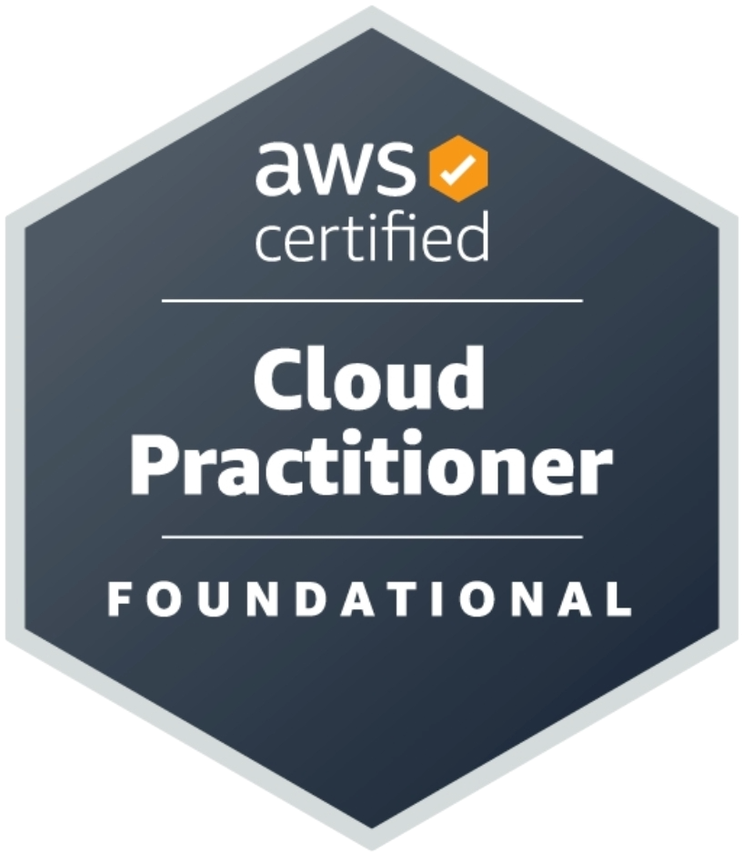
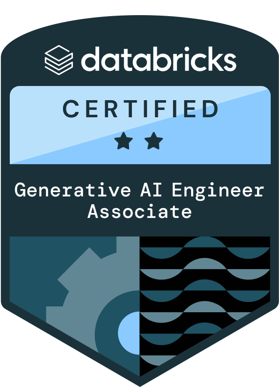
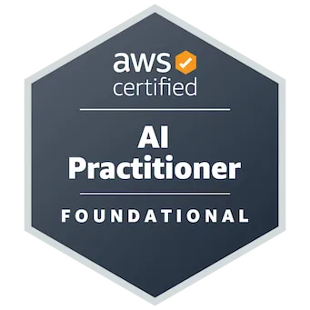
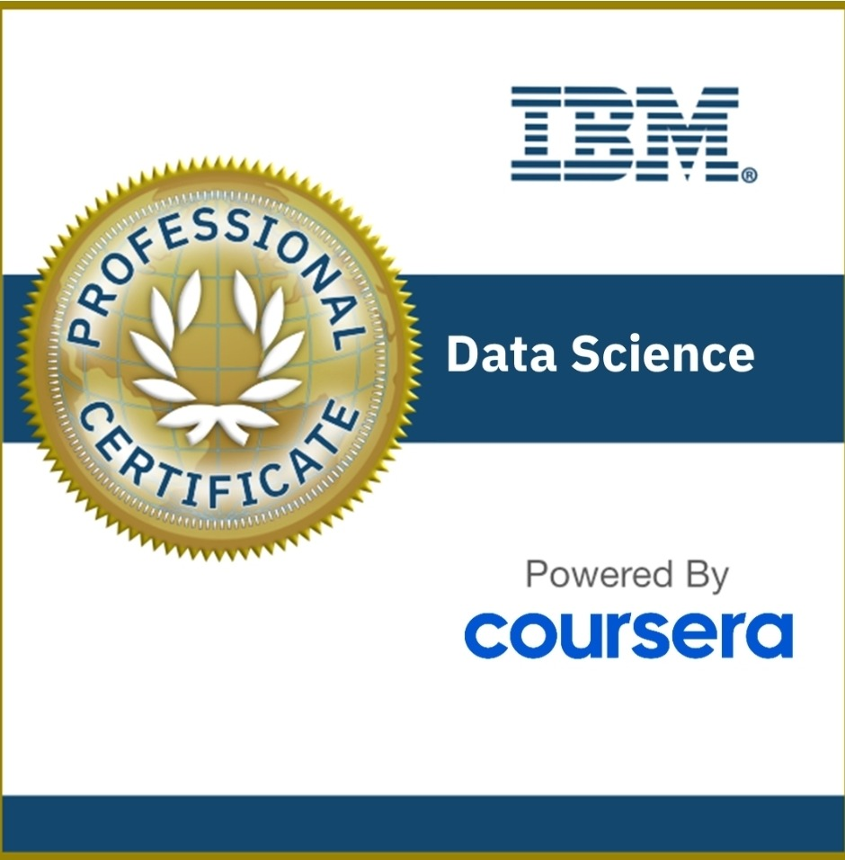

  

    
    
Deep Learning Architect at AWS

    <h1>Dimas Jackson, PhD</h1>
    
Building scalable AI for Financial Service Institutions at the AWS Gen AI Innovation Center. I design agentic systems, LLM pipelines, and secure cloud architectures that turn R&D into reliable enterprise outcomes.

    

      São Paulo, Brasil
      AWS Gen AI Innovation Center
      Financial Service Institutions
    

    

      Deep Learning
      Agentic AI
      Amazon Bedrock
      RAG
      Prompt Engineering
    

    

      <a class="social-link" href="https://www.linkedin.com/in/dimas-jackson" target="_blank">LinkedIn</a>
      <a class="social-link" href="https://github.com/dimasjackson" target="_blank">GitHub</a>
      <a class="social-link" href="https://gitlab.com/dimas.jackson" target="_blank">GitLab</a>
      <a class="social-link" href="mailto:dimasjac@amazon.com">Email</a>
    

  

  

    

      
Current role

      <h2>Deep Learning Architect @Amazon</h2>
      
Driving generative AI and agentic AI architecture for Financial Services clients.

    

    

      
Recent impact

      <h2>$2M ARR</h2>
      
Delivered AI-powered conversational experiences that accelerated sales performance.

    

    

      
Engineering outcome

      <h2>90% efficiency gain</h2>
      
Architected code remediation agents to accelerate compliant adoption of Brazil’s alphanumeric CNPJ standard.

    

  

## Summary

I'm an architect with deep expertise in AI, cloud engineering, and financial services. I build end-to-end systems that combine LLMs, autonomous agents, and secure AWS deployments to deliver measurable business value.

  

    <h3>What I do</h3>
    <ul>
      <li>Design scalable AI solutions on AWS for FSIs and enterprise teams</li>
      <li>Build agentic systems that automate compliance, code remediation, and workflows</li>
      <li>Lead pilots with Amazon Q, Bedrock, MCP, Databricks, and multi-cloud integrations</li>
    </ul>
  

  

    <h3>Why it matters</h3>
    <ul>
      <li>Turns AI prototypes into production-ready systems with governance</li>
      <li>Reduces developer risk while improving operational efficiency</li>
      <li>Aligns AI architecture with business outcomes and enterprise strategy</li>
    </ul>
  

## Experience

  

    
November 2025 – Present

    <h3>Deep Learning Architect, AWS</h3>
    
AWS Gen AI Innovation Center, São Paulo

    <ul>
      <li>Led Agentic AI initiatives for Financial Services clients, delivering AI-powered conversational experiences and driving $2M ARR.</li>
    </ul>
  

  

    
July 2024 – November 2025

    <h3>Senior AI Architect, Santander</h3>
    
São Paulo, Brasil

    <ul>
      <li>Architected an AI agent to detect and remediate legacy CNPJ code with an estimated 90% reduction in time and cost.</li>
      <li>Designed a global-scale speech recognition architecture and generative AI solution.</li>
      <li>Validated enterprise pilots using Amazon Q, A2A, MCP, Databricks, and Power BI.</li>
    </ul>
  

  

    
May 2023 – July 2024

    <h3>Data and AI Consultant, Mackenzie</h3>
    
São Paulo, Brasil

    <ul>
      <li>Built knowledge graph and natural language search solutions over institutional datasets.</li>
      <li>Improved SQL procedures performance by up to 400%.</li>
    </ul>
  

  

    
March 2021 – May 2023

    <h3>Research Fellow, CAPES</h3>
    
São Paulo, Brasil

    <ul>
      <li>Led advanced machine learning and Bayesian inference research for General Relativity applications.</li>
      <li>Published peer-reviewed articles in top-tier journals and presented findings at international conferences.</li>
      <li>Developed computational models and validated results with rigorous theoretical analysis.</li>
    </ul>
  

## Expertise

  Deep Learning
  Agentic AI
  AWS Bedrock
  Amazon Q
  RAG
  LLMs
  Prompt Engineering
  AI Governance
  Databricks
  Python
  Cloud Architecture
  Speech Recognition

## Certifications

  

    
    <h4><a href="https://www.credly.com/badges/3dbdb8cc-8328-4246-aa42-19366b068794/public_url" target="_blank" rel="noopener">AWS Certified Solutions Architect Associate</a></h4>
    
Amazon Web Services (AWS)

    Nov 2024
  

  

    
    <h4><a href="https://www.credly.com/badges/30025ddf-e9bb-4a59-a218-43134a7ab89c/linked_in_profile" target="_blank" rel="noopener">AWS Certified Cloud Practitioner</a></h4>
    
Amazon Web Services (AWS)

    Nov 2024
  

  

    
    <h4><a href="https://credentials.databricks.com/89ba5272-a0cd-4e7e-9753-8ebadbb9de26" target="_blank" rel="noopener">Generative AI Fundamentals</a></h4>
    
Databricks

    Sep 2024
  

  

    
    <h4><a href="https://aws.amazon.com/certification/certified-ai-practitioner/" target="_blank" rel="noopener">AWS AI Practitioner</a></h4>
    
Amazon Web Services (AWS)

    Jun 2024
  

  

    
    <h4><a href="https://www.credly.com/badges/6efd515f-7553-4c12-b68b-34629b3d1cb6/linked_in_profile" target="_blank" rel="noopener">Data Science Professional Certificate (V2)</a></h4>
    
IBM

    May 2023
  

## Publications

  

    
📄

    <h4><a href="https://aclanthology.org/2024.kallm-1.4/" target="_blank" rel="noopener">Application of Generative AI as an Enterprise Wikibase Knowledge Graph Q&A System</a></h4>
    
Proceedings of the 1st Workshop on Knowledge Graphs and Large Language Models (KaLLM 2024)

  

  

    
📄

    <h4><a href="https://repositorio.unesp.br/entities/publication/fa3ddb53-352e-48bd-9451-76e2b1c8f400" target="_blank" rel="noopener">Cosmological models based on Lyra's differential geometry</a></h4>
    
Revista Brasileira de Ensino de Física

  

  

    
📄

    <h4><a href="https://doi.org/10.1590/1806-9126-RBEF-2023-0099" target="_blank" rel="noopener">A Pedagogical Introduction to Resurgent Transeries</a></h4>
    
Revista Brasileira de Ensino de Física

  

  

    
📄

    <h4><a href="https://doi.org/10.1590/1806-9126-RBEF-2022-0166" target="_blank" rel="noopener">Nonlocality in Field Theories and Applications</a></h4>
    
Revista Brasileira de Ensino de Física

  

  

    
📄

    <h4><a href="https://iopscience.iop.org/article/10.1088/1475-7516/2023/05/010" target="_blank" rel="noopener">Structure formation in non-local bouncing models</a></h4>
    
Journal of Cosmology and Astroparticle Physics

  

## Contact

  
<strong>Email</strong>: <a href="mailto:dimasjac@amazon.com">dimasjac@amazon.com</a>

  
<strong>Phone</strong>: +55 35 98875 5029

  
<strong>LinkedIn</strong>: <a href="https://www.linkedin.com/in/dimas-jackson" target="_blank">linkedin.com/in/dimas-jackson</a>

> Disclaimer: The opinions expressed here are my own and do not represent the positions of Amazon, AWS, or any of its affiliates.
